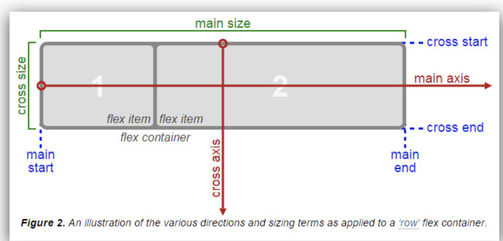

# Flex
## 簡介
是一種 css 針對頁面排版的一種方法 ，  
分為`外部容器(container)` & `內部元件(items)` 兩方面的設定

###  外部容器 Container
外部容器負責的是內部元件的排列方式以及方向 ，

根據 flex  模型圖來看會有幾個參考點

分兩大類別：
- main axis  
根據 flex 方向來決定
- cross axis  
跟 `main axis` 為垂直的軸

每個類別包含有：
- start  
此軸的啟始
- end  
此軸的結束
- size  
此軸的長度

#### 相關設定： 
- flex-direction  
設定 item 排列方向，並決定好上述的參考點，分別為：
    - row  
    橫向排列，以左至右
    - column  
    縱向排列，以上至下
    - row-reverse  
    橫向排列，以右至左
    - column-reverse
    縱向排列，以下至上
- flex-wrap  
設定內容物件是否需要換行，其相關設定為：
    - nowarp  
    預設，單行顯示
    - wrap  
    總長度超出設定寬度就換行
    - wrap-reverse  
    反轉排序
- justify-content
以 `main axis` 為基準來對齊，分別為：
    - flex-start  
    以 `main start` 對齊
    - flex-end  
    以 `main end` 對齊
    - center  
    以 `main axis`中間 對齊
    - space-between  
    平均分配 `main size` 空間， 第一個 ＆ 最後一個 item 對齊 start & end
    - space-around  
    平均分配 `main size` 空間
- align-items  
是以**單行**為單位處理，以 `cross axis` 為基準來對齊，分別為：
    - flex-start  
    以 `cross start` 對齊
    - flex-end  
    以 `cross end` 對齊
    - center  
    以 `cross axis`中間 對齊
    - stretch
    如 item 尚未設定長度，強制拉伸 item 至 `cross size` 同等長度
    - baseline
    以 item 的 baseline 為基準做對齊
- align-content  
是根據**全部內容**處理，以 `cross axis` 為基準來對齊，分別為：
    - flex-start  
    以 `cross start` 對齊
    - flex-end  
    以 `cross end` 對齊
    - center  
    以 `cross axis`中間 對齊
    - stretch
    如 item 尚未設定長度，強制拉伸 item 至 `cross size` 同等長度
    - baseline
    以 item 的 baseline 為基準做對齊
    - space-between  
    平均分配 `cross size` 空間，  第一個 ＆ 最後一個  item 對齊 start & end
    - space-around  
    平均分配 `cross size` 空間

#### align-content vs align-items  

###  內部元件 Items
針對元件本身內部空間相關的設定

#### 相關設定： 
- flex : [grow]  [shrink]   [basis] 
    - flex-grow  
    在外部容器尚有空間時，依據數值擴展元件大小，0 為不啟用，皆以整數設定
    - flex-shrink  
    在外部容器空間不夠時，依據數值縮減元件大小，0 為不啟用，皆以整數設定
    - flex-basis  
    此元件基礎長度，可套用不同單位(px、%、em ...etc)
- order  
調整元件順序，數字越小越靠前
- algin-self   
單獨對元件設定，跟**align-items**一樣的設定