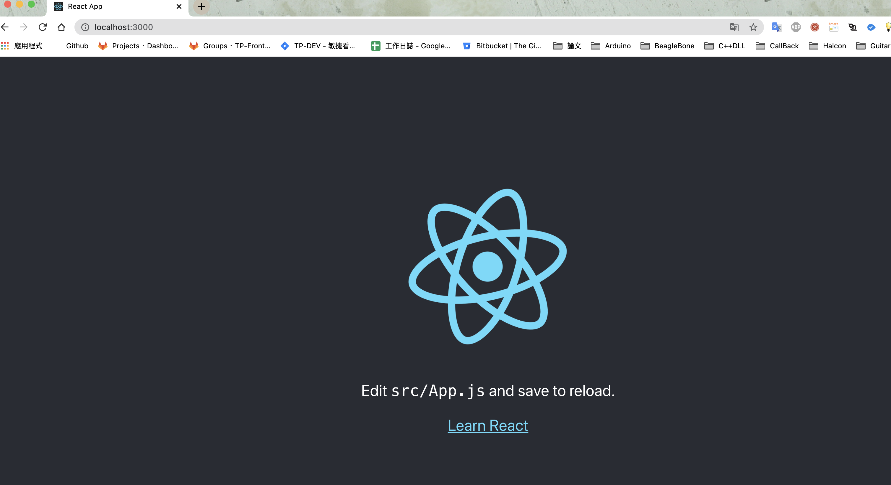

# 需要工具
## NVM
### 簡述
 nodejs 版本管理器
### 安裝
```sh
$ brew install nvm
```
### 設定
```sh
$ echo "source $(brew --prefix nvm)/nvm.sh" >> .bash_profile # 把 nvm.sh 路徑放入到 .bash_profile
$ . ~/.bash_profile #更新設定
```

## NodeJS

### 簡述

在本地端可以執行 javascript 的一個開發環境

### 安裝(擇一)
1. [官網](https://nodejs.org/en/)下載安裝
2. Homebrew
``` sh
$ brew search node #尋找可安裝版本
$ brew install node@<version> #安裝
```
3. nvm
``` sh
$ nvm ls-remote #尋找可安裝版本
$ nvm install <version> # 安裝
```

## Yarn
### 簡述
package 管理器，管理專案的 package 

### 安裝 
``` sh
$ brew install yarn # 安裝
```


# CRA 
## 簡述
facebook 推出的官方 reactJS Scaffold ， 讓你站在巨人的肩膀上，降低開發技術需求，建立專案後即可開發  

## 安裝 by yarn 
``` sh
# yarn 版本需高過 0.25
$ yarn create react-app <app name> # 安裝 
```

## 指令
``` sh
$ yarn start # 開啟 dev server
$ yarn run build # 打包正式版
$ yarn run test # 啟動測試
$ yarn run eject # 解開 cra 封裝，
```


## 特色
- 可以設定環境變數，可針對不同環境做不同的設定
- 可額外擴充環境變數
- 測試、打包免設定
- 內建 dev server，支援 hot reload，遇到衝突可換 port
- 最基礎的 robot.txt & manifest.json
- 簡單指令，輕鬆執行打包(build)、本地開發(localhost)
- 額外客製化 template
- 附加 `browserlist`
- 支援 
    - Exponentiation Operator - 指數運算子(**)
    - async/await 語法
    - rest/spreed Operator - 解構運算 (...)
    - dynamic import
    - Class 宣告 ＆ static 屬性
    - JSX 語法


## 注意
- 需要經過 webpack 編譯的檔案(ex: .js .css ...etc)，請放在 `src`資料夾內
- 程式進入點為 `src/index.js`，不可**更改名稱**或**刪除此檔案**
- 打包後的檔案統一放在 `build` 資料夾
- `public/index.html`為打包後的網頁板模  
- 不需要任何處理的檔案，但需要放進 `build` 資料夾，可放在 `public` 資料夾 
- eject 後就無法在封裝了，請謹慎使用


